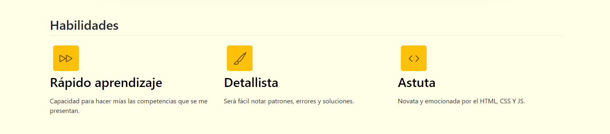
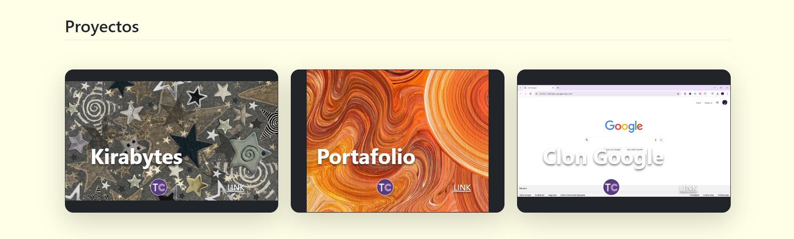
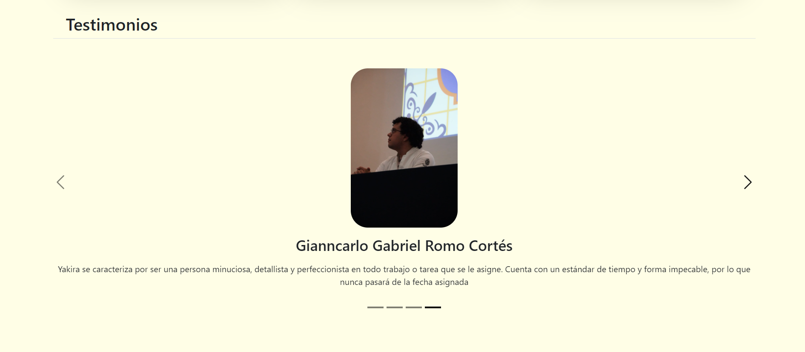

# Portafolio de habilidades Technolochicas PRO

El presente proyecto es un portafolio desarrollado para poner en práctica las habilidades obtenidas dentro del bootcamp de desarrollo front-end de Technolochicas PRO.

Fue desarrollado con HTML, CSS y JS con el uso del framework de UI, BootStrap, utilizando además bibliotecas externas.

La página es responsiva (adaptable a diferentes tamaños de pantalla) e incluye la presentación de la autora del proyecto.

[Proyecto Desplegado](https://portafolio-xi-wheat.vercel.app/)

## Secciones de mi sitio

## Tecnologías

* HTML
* CSS
* BootStrap
* JavaScript
___

Desarrollado con 💕 por Yakira en Technolochicas PRO.